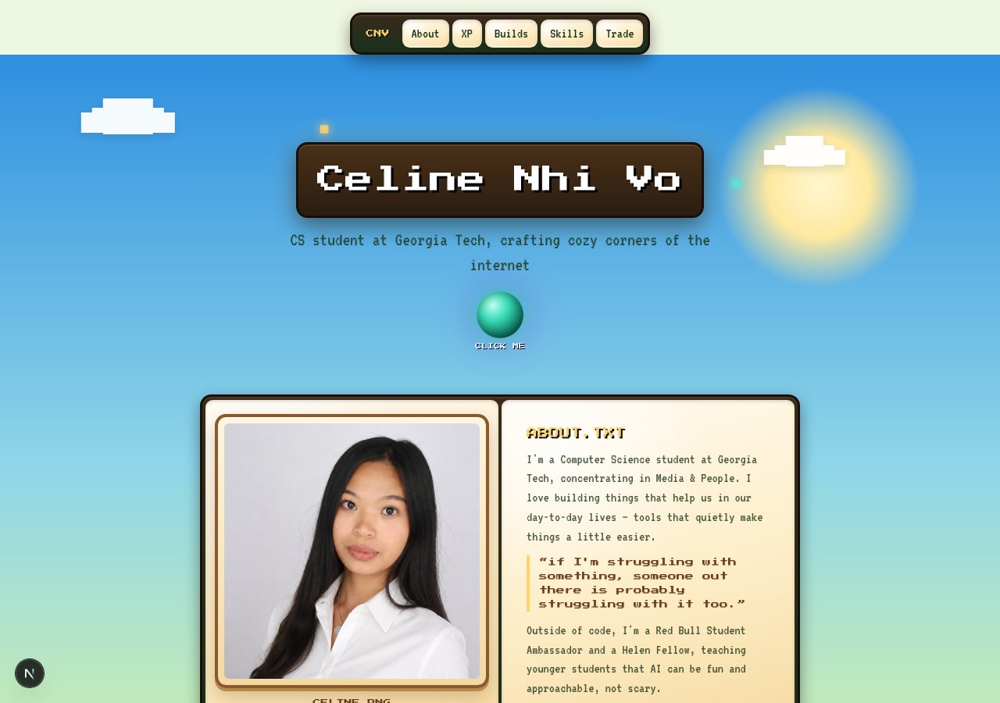

<div align="center">


### 🌎 **[→ VIEW LIVE SITE: celine-portfolio.pages.dev ←](https://celine-portfolio.pages.dev)**
#### the site is already live and hosted on Cloudflare — nothing below is required to view it


</div>

<br/>



## 🧱 about this build

A personal portfolio site built entirely as a Minecraft-flavored world: a
scenic grass hillside hero with wandering mobs, and each section themed to
its own biome —

- 🌙 **Experience** → Night Raid — creeper, zombie, and skeleton out among the quest cards
- 🪸 **Builds** → Coral Reef — fish, a turtle, a dolphin, and a boat bobbing on the water
- 🌌 **Skills** → The End — Endermen and a Ghast drifting through the void
- 🔮 A clickable ender pearl orb teleports you down to Skills

Everything is built from scratch with CSS — pixel fonts, GUI-panel bevels,
glowing buttons, and hand-coded critter sprites — no game assets, no images
besides the photo and preview above.

## ⛏️ tech stack

- **Next.js 16** (App Router, static export)
- **TypeScript**
- **Tailwind CSS v4**
- Google Fonts: `Press Start 2P` + `VT323`
- Deployed on **Cloudflare Pages**

---

## 💻 for developers (optional)

The site above is already live and self-contained — you only need the steps
below if you want to edit the code and run your own local copy.

### run it locally

```bash
npm install
npm run dev
```

### deploy your changes

```bash
npm run build
npx wrangler pages deploy out --project-name=celine-portfolio
```

---

<div align="center">
made by <a href="https://github.com/NhiTech">Celine Nhi Vo</a>
</div>
